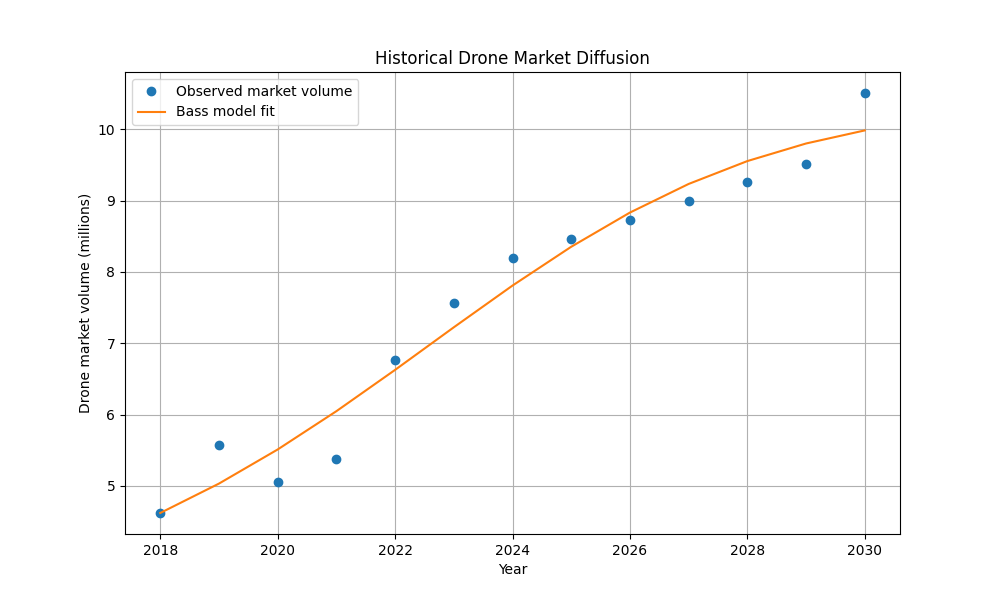
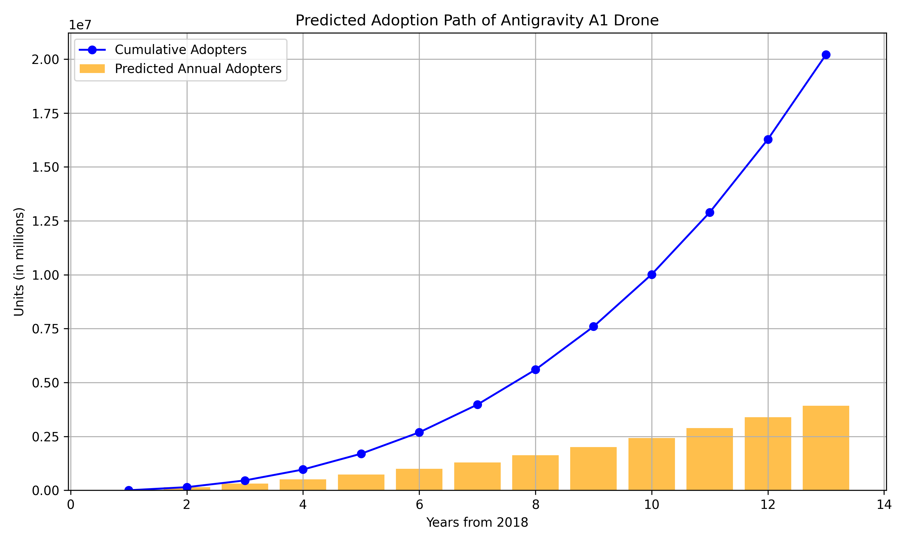

# Innovation Diffusion Analysis: Antigravity A1 Drone

**Student:** Emilya Sepoyan
**Course:** Marketing Analytics  
**Date:** March 5, 2026  

---

## 1. Selected Innovation  

**Product:** Antigravity A1 – an immersive, 360-degree drone camera  

**Description:**  
The Antigravity A1 is a lightweight drone (249 grams) designed around a 360-degree camera. It comes with head-tracking goggles and a single-hand controller, allowing pilots to see from the drone’s perspective in any direction. Because of its weight, U.S. buyers and most global markets do not require a drone license to operate it.  

**Source:** [Antigravity A1](https://time.com/collection/top-100-innovations-2025/)  

---

## 2. Historical Comparison  

**Look-alike Innovation:** DJI Phantom 4 Pro (2016)  

The DJI Phantom 4 Pro was one of the first widely-adopted drones to integrate high-resolution cameras for immersive flight experiences. Like the Antigravity A1, it targeted consumer-level pilots but did not initially include a full 360-degree camera or head-tracking goggles. The Antigravity A1 improves on the Phantom 4 Pro by designing the drone specifically for immersive 360-degree viewing from the start, enhancing the market appeal and user experience. Both innovations impact the drone market by making aerial photography and immersive experiences more accessible to consumers.  

---

## 3. Historical Data  

**Dataset Used:** Volume of the drone market worldwide (2018–2030)  

**Description:**  
- The volume in the 'Drones' segment of the consumer electronics market worldwide was 8.19 million units in 2024.  
- Between 2018–2024, the market rose by 3.57 million units, with uneven growth.  
- From 2024–2030, volume is projected to increase by 2.32 million units.  

**Source:** Statista, *Drones Market Insights* (2026)  

**Dataset:** `data/statistic_id1399076_volume-of-thedrone-market-worldwide-2018-2030.xlsx`  

| Year | Volume (millions) |
|------|------------------|
| 2018 | 4.62             |
| 2019 | 5.57             |
| 2020 | 5.06             |
| 2021 | 5.38             |
| 2022 | 6.76             |
| 2023 | 7.56             |
| 2024 | 8.19             |
| 2025 | 8.46             |
| 2026 | 8.73             |
| 2027 | 9.00             |
| 2028 | 9.26             |
| 2029 | 9.52             |
| 2030 | 10.51            |  

---

## 4. Bass Model Estimation  

Using the historical data, the Bass diffusion model parameters were estimated via nonlinear curve fitting.  

**Estimated Parameters:**  

| Parameter | Value       |
|-----------|------------|
| p (Innovation coefficient) | -0.1273   |
| q (Imitation coefficient)  | 0.4476    |
| M (Market potential)       | 10.43 M   |  

**Notes:**  
- Negative p may indicate the early adoption in this dataset is smaller than expected.  
- q shows a moderate imitation effect, meaning peer influence drives adoption.  

**Plot 1: Historical Drone Market Diffusion**  
  

---

## 5. Predicted Diffusion of Antigravity A1  

Based on the estimated Bass parameters, the diffusion path of the Antigravity A1 was forecasted.  

**Methodology:**  
- The model predicts annual and cumulative adopters.  
- Forecasting was done globally using the total market potential (M).  

**Plot 2: Predicted Adoption Path of Antigravity A1 Drone**  
  

**Table: Historical vs Predicted Adoption**  

| Year | Historical Volume | Bass Predicted | Cumulative Predicted |
|------|-----------------|----------------|---------------------|
| 2018 | 4.62            | 0.00           | 0.00                |
| 2019 | 5.57            | 0.19           | 0.19                |
| 2020 | 5.06            | 0.27           | 0.46                |
| 2021 | 5.38            | 0.42           | 0.88                |
| 2022 | 6.76            | 0.66           | 1.54                |
| 2023 | 7.56            | 1.03           | 2.57                |
| 2024 | 8.19            | 1.51           | 4.08                |
| 2025 | 8.46            | 2.07           | 6.15                |
| 2026 | 8.73            | 2.65           | 8.79                |
| 2027 | 9.00            | 3.10           | 11.89               |
| 2028 | 9.26            | 3.30           | 15.19               |
| 2029 | 9.52            | 3.32           | 18.51               |
| 2030 | 10.51           | 3.35           | 21.86               |  

**Data file:** `data/antigravityA1_forecast.csv`  

---

## 6. Scope  

The analysis focuses on **global market diffusion** because:  
- The Antigravity A1 is marketed internationally.  
- Statista dataset provides worldwide volumes.  
- Licensing restrictions are mostly universal (U.S. and major markets).  

---

## 7. References  

1. Statista. *Volume of the drone market worldwide 2018–2030*. [https://www.statista.com/forecasts/1399076/drone-market-volume-worldwide/] 
2. Time Magazine. *Top 100 Innovations 2025*. [https://time.com/collections/best-inventions-2025/7318266/antigravity-a1/] 
3. DJI. *Phantom 4 Pro Specs*. [https://www.dji.com/phantom-4-pro](https://www.dji.com/phantom-4-pro)